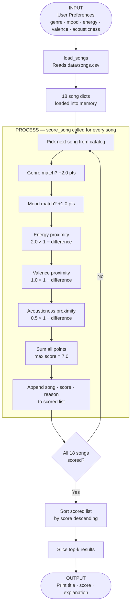

# 🎵 Music Recommender Simulation

## Project Summary

In this project you will build and explain a small music recommender system.

Your goal is to:

- Represent songs and a user "taste profile" as data
- Design a scoring rule that turns that data into recommendations
- Evaluate what your system gets right and wrong
- Reflect on how this mirrors real world AI recommenders

This simulation builds a content-based music recommender that scores every song in a small catalog against a user's taste profile and returns the top matches. It prioritizes three numeric audio features — energy, valence, and acousticness — combined with categorical bonuses for matching mood and genre. The system is transparent by design: every recommendation includes a plain-language explanation of exactly why each song was selected.

---

## How The System Works

Explain your design in plain language.

Real-world recommenders like Spotify combine collaborative filtering (learning from what similar users liked) and content-based filtering (matching song attributes to a user's taste). This simulation focuses on content-based filtering — it compares measurable song properties directly against a user's stated preferences, so it works immediately without any listening history. This version prioritizes energy and emotional tone above genre, because those two features most directly capture how a song feels in the moment.

**Song features used:** `genre`, `mood`, `energy`, `valence`, `acousticness`, `tempo_bpm`, `danceability`

**UserProfile fields used:** `favorite_genre`, `favorite_mood`, `target_energy`, `likes_acoustic`

Some prompts to answer:

- What features does each `Song` use in your system
  - For example: genre, mood, energy, tempo
- What information does your `UserProfile` store
- How does your `Recommender` compute a score for each song
- How do you choose which songs to recommend

You can include a simple diagram or bullet list if helpful.



---

### Finalized Algorithm Recipe

Every song in the catalog is scored using this formula. Points are added up and the highest-scoring songs are returned first.

| Rule | Points | Condition |
|---|---|---|
| Genre match | **+2.0** | `song.genre == user.genre` (exact string match) |
| Mood match | **+1.0** | `song.mood == user.mood` (exact string match) |
| Energy proximity | **up to +2.0** | `2.0 × (1 − \|song.energy − user.energy\|)` |
| Valence proximity | **up to +1.0** | `1.0 × (1 − \|song.valence − user.valence\|)` |
| Acousticness proximity | **up to +0.5** | `0.5 × (1 − \|song.acousticness − user.acousticness\|)` |
| **Max possible score** | **7.0** | All five rules fire at full value |

The proximity formula rewards closeness, not magnitude — a song with energy 0.44 scores higher than one with energy 0.93 for a user whose target energy is 0.42, because 0.44 is *closer*.

**User profile used in this simulation:**

```python
user_prefs = {
    "genre":        "lofi",
    "mood":         "focused",
    "energy":       0.42,
    "valence":      0.60,
    "acousticness": 0.75,
}
```

---

### Potential Biases

- **Genre dominance.** A genre match alone adds +2.0 points — the single largest bonus available. A lofi song with a poor energy match can still outscore a perfect-energy jazz track simply because of its label. This means the system may surface mediocre matches within the preferred genre before excellent matches outside it.

- **Mood sparsity.** With `mood = "focused"`, the +1.0 bonus fires for only one song in the original catalog (Focus Flow). Most songs never earn a mood bonus, so mood ends up having less influence than its weight suggests. A user whose mood is rare in the catalog is effectively scored on four features, not five.

- **Double-penalizing high-energy songs.** Energy and acousticness are strongly inversely correlated in this dataset — high-energy songs are almost always low-acoustic. For a chill user (low energy, high acousticness), both features penalize the same tracks simultaneously, making the system harsher toward energetic songs than either weight alone implies.

- **Thin genre coverage.** After expansion, genres like metal, classical, folk, and reggae each have only one representative song. Even if those genres are a reasonable fit, the system has no room to find a *good* representative — it either returns that one song or nothing from that genre.

- **No vocal awareness.** The system cannot distinguish between vocal and instrumental tracks. For a `focused` study user, instrumental lofi is meaningfully different from vocal lofi, but both score identically on every numeric feature.

---

## Sample Output

Terminal output when running `python src/main.py` with the default `pop / happy` profile:

```
Loaded songs: 18

========================================================
   Music Recommender — Top 5 Results
========================================================
  Profile : genre=pop | mood=happy
            energy=0.8 | valence=0.8 | acousticness=0.2
========================================================

  #1  Sunrise City  (Score: 6.41 / 7.0)
       Artist : Neon Echo
       Genre  : pop  |  Mood : happy
       Why    : genre 'pop' matches (+2.0); mood 'happy' matches (+1.0); energy 0.82 is close to your target 0.8 (+1.96)
  ------------------------------------------------------

  #2  Gym Hero  (Score: 5.13 / 7.0)
       Artist : Max Pulse
       Genre  : pop  |  Mood : intense
       Why    : genre 'pop' matches (+2.0); energy 0.93 is close to your target 0.8 (+1.74)
  ------------------------------------------------------

  #3  Rooftop Lights  (Score: 4.34 / 7.0)
       Artist : Indigo Parade
       Genre  : indie pop  |  Mood : happy
       Why    : mood 'happy' matches (+1.0); energy 0.76 is close to your target 0.8 (+1.92)
  ------------------------------------------------------

  #4  Crown Protocol  (Score: 3.16 / 7.0)
       Artist : Verse Division
       Genre  : hip-hop  |  Mood : confident
       Why    : energy 0.72 is close to your target 0.8 (+1.84)
  ------------------------------------------------------

  #5  Night Drive Loop  (Score: 3.08 / 7.0)
       Artist : Neon Echo
       Genre  : synthwave  |  Mood : moody
       Why    : energy 0.75 is close to your target 0.8 (+1.9)
  ------------------------------------------------------
```

**Why these results make sense:** Sunrise City earns the maximum available bonus points — it matches genre, mood, and energy simultaneously. Gym Hero ranks second because the genre match (+2.0) outweighs its missing mood bonus. Rooftop Lights reaches #3 through the mood match alone, despite being labelled `indie pop` rather than `pop`. Songs #4 and #5 have no categorical matches at all — they rank purely on how close their energy is to the user's target of 0.80.

---

## Getting Started

### Setup

1. Create a virtual environment (optional but recommended):

   ```bash
   python -m venv .venv
   source .venv/bin/activate      # Mac or Linux
   .venv\Scripts\activate         # Windows

2. Install dependencies

```bash
pip install -r requirements.txt
```

3. Run the app:

```bash
python -m src.main
```

### Running Tests

Run the starter tests with:

```bash
pytest
```

You can add more tests in `tests/test_recommender.py`.

---

## Experiments You Tried

Use this section to document the experiments you ran. For example:

- What happened when you changed the weight on genre from 2.0 to 0.5
- What happened when you added tempo or valence to the score
- How did your system behave for different types of users

Six profiles were tested — three standard and three adversarial edge cases.

---

### Profile 1 — High-Energy Pop

```
============================================================
  Profile 1 — High-Energy Pop
============================================================
  Profile : genre=pop | mood=happy | energy=0.88 | valence=0.85 | acousticness=0.1
============================================================

  #1  Sunrise City  (Score: 6.33 / 7.0)
       Artist : Neon Echo
       Genre  : pop  |  Mood : happy
       Why    : genre 'pop' matches (+2.0); mood 'happy' matches (+1.0); energy 0.82 is close to your target 0.88 (+1.88)
  ----------------------------------------------------------

  #2  Gym Hero  (Score: 5.29 / 7.0)
       Artist : Max Pulse
       Genre  : pop  |  Mood : intense
       Why    : genre 'pop' matches (+2.0); energy 0.93 is close to your target 0.88 (+1.9)
  ----------------------------------------------------------

  #3  Rooftop Lights  (Score: 4.10 / 7.0)
       Artist : Indigo Parade
       Genre  : indie pop  |  Mood : happy
       Why    : mood 'happy' matches (+1.0); energy 0.76 is close to your target 0.88 (+1.76)
  ----------------------------------------------------------

  #4  Orbit Rush  (Score: 3.27 / 7.0)
       Artist : Novalux
       Genre  : edm  |  Mood : euphoric
       Why    : energy 0.96 is close to your target 0.88 (+1.84)
  ----------------------------------------------------------

  #5  Night Drive Loop  (Score: 3.08 / 7.0)
       Artist : Neon Echo
       Genre  : synthwave  |  Mood : moody
       Why    : energy 0.75 is close to your target 0.88 (+1.9)
  ----------------------------------------------------------
```

**Observation:** Sunrise City earned all three bonuses (genre + mood + energy), landing at #1 cleanly. The gap between #3 (4.10) and #4 (3.27) is large — this is the cliff where categorical bonuses stop firing entirely.

---

### Profile 2 — Chill Lofi

```
============================================================
  Profile 2 — Chill Lofi
============================================================
  Profile : genre=lofi | mood=chill | energy=0.38 | valence=0.58 | acousticness=0.82
============================================================

  #1  Library Rain  (Score: 6.40 / 7.0)
       Artist : Paper Lanterns
       Genre  : lofi  |  Mood : chill
       Why    : genre 'lofi' matches (+2.0); mood 'chill' matches (+1.0); energy 0.35 is close to your target 0.38 (+1.94)
  ----------------------------------------------------------

  #2  Midnight Coding  (Score: 6.35 / 7.0)
       Artist : LoRoom
       Genre  : lofi  |  Mood : chill
       Why    : genre 'lofi' matches (+2.0); mood 'chill' matches (+1.0); energy 0.42 is close to your target 0.38 (+1.92)
  ----------------------------------------------------------

  #3  Focus Flow  (Score: 5.43 / 7.0)
       Artist : LoRoom
       Genre  : lofi  |  Mood : focused
       Why    : genre 'lofi' matches (+2.0); energy 0.4 is close to your target 0.38 (+1.96)
  ----------------------------------------------------------

  #4  Spacewalk Thoughts  (Score: 4.18 / 7.0)
       Artist : Orbit Bloom
       Genre  : ambient  |  Mood : chill
       Why    : mood 'chill' matches (+1.0); energy 0.28 is close to your target 0.38 (+1.8)
  ----------------------------------------------------------

  #5  Coffee Shop Stories  (Score: 3.31 / 7.0)
       Artist : Slow Stereo
       Genre  : jazz  |  Mood : relaxed
       Why    : energy 0.37 is close to your target 0.38 (+1.98)
  ----------------------------------------------------------
```

**Observation:** The top 3 are all lofi, correctly ordered. Spacewalk Thoughts (ambient/chill) sneaks into #4 via the mood bonus — a genuine cross-genre discovery the system made correctly.

---

### Profile 3 — Deep Intense Rock

```
============================================================
  Profile 3 — Deep Intense Rock
============================================================
  Profile : genre=rock | mood=intense | energy=0.92 | valence=0.42 | acousticness=0.08
============================================================

  #1  Storm Runner  (Score: 6.41 / 7.0)
       Artist : Voltline
       Genre  : rock  |  Mood : intense
       Why    : genre 'rock' matches (+2.0); mood 'intense' matches (+1.0); energy 0.91 is close to your target 0.92 (+1.98)
  ----------------------------------------------------------

  #2  Gym Hero  (Score: 4.11 / 7.0)
       Artist : Max Pulse
       Genre  : pop  |  Mood : intense
       Why    : mood 'intense' matches (+1.0); energy 0.93 is close to your target 0.92 (+1.98)
  ----------------------------------------------------------

  #3  Iron Meridian  (Score: 3.19 / 7.0)
       Artist : Blastforge
       Genre  : metal  |  Mood : angry
       Why    : energy 0.97 is close to your target 0.92 (+1.9)
  ----------------------------------------------------------

  #4  Night Drive Loop  (Score: 3.02 / 7.0)
       Artist : Neon Echo
       Genre  : synthwave  |  Mood : moody
       Why    : general audio similarity
  ----------------------------------------------------------

  #5  Orbit Rush  (Score: 2.93 / 7.0)
       Artist : Novalux
       Genre  : edm  |  Mood : euphoric
       Why    : energy 0.96 is close to your target 0.92 (+1.92)
  ----------------------------------------------------------
```

**Observation:** Storm Runner (#1) is a perfect triple match. The 2.3-point gap to Gym Hero (#2) shows how decisive the genre bonus is when only one song in the catalog actually matches the genre.

---

### EDGE 1 — Genre Trap (lofi label + intense energy=0.93)

```
============================================================
  EDGE 1 — Genre Trap  (lofi label + intense energy)
============================================================
  Profile : genre=lofi | mood=intense | energy=0.93 | valence=0.75 | acousticness=0.12
============================================================

  #1  Gym Hero  (Score: 4.45 / 7.0)
       Artist : Max Pulse
       Genre  : pop  |  Mood : intense
       Why    : mood 'intense' matches (+1.0); energy 0.93 is close to your target 0.93 (+2.0)
  ----------------------------------------------------------

  #2  Storm Runner  (Score: 4.18 / 7.0)
       Artist : Voltline
       Genre  : rock  |  Mood : intense
       Why    : mood 'intense' matches (+1.0); energy 0.91 is close to your target 0.93 (+1.96)
  ----------------------------------------------------------

  #3  Midnight Coding  (Score: 4.00 / 7.0)
       Artist : LoRoom
       Genre  : lofi  |  Mood : chill
       Why    : genre 'lofi' matches (+2.0)
  ----------------------------------------------------------

  #4  Focus Flow  (Score: 3.95 / 7.0)
       Artist : LoRoom
       Genre  : lofi  |  Mood : focused
       Why    : genre 'lofi' matches (+2.0)
  ----------------------------------------------------------

  #5  Library Rain  (Score: 3.82 / 7.0)
       Artist : Paper Lanterns
       Genre  : lofi  |  Mood : chill
       Why    : genre 'lofi' matches (+2.0)
  ----------------------------------------------------------
```

**Finding:** The genre trap worked — the system "split its vote." Pop and rock tracks won #1 and #2 because mood+energy aligned perfectly. Lofi tracks cluster at #3–#5 earning only their genre bonus (+2.0) with terrible energy proximity. No song in the catalog satisfies both constraints at once, so the two halves of the profile compete against each other.

---

### EDGE 2 — Emotional Conflict (high energy + sad mood)

```
============================================================
  EDGE 2 — Emotional Conflict  (high energy + sad mood)
============================================================
  Profile : genre=rock | mood=sad | energy=0.9 | valence=0.28 | acousticness=0.08
============================================================

  #1  Storm Runner  (Score: 5.27 / 7.0)
       Artist : Voltline
       Genre  : rock  |  Mood : intense
       Why    : genre 'rock' matches (+2.0); energy 0.91 is close to your target 0.9 (+1.98)
  ----------------------------------------------------------

  #2  Iron Meridian  (Score: 3.29 / 7.0)
       Artist : Blastforge
       Genre  : metal  |  Mood : angry
       Why    : energy 0.97 is close to your target 0.9 (+1.86)
  ----------------------------------------------------------

  #3  Last Highway Home  (Score: 3.16 / 7.0)
       Artist : June Calloway
       Genre  : country  |  Mood : sad
       Why    : mood 'sad' matches (+1.0)
  ----------------------------------------------------------

  #4  Gym Hero  (Score: 2.93 / 7.0)
       Artist : Max Pulse
       Genre  : pop  |  Mood : intense
       Why    : energy 0.93 is close to your target 0.9 (+1.94)
  ----------------------------------------------------------

  #5  Night Drive Loop  (Score: 2.92 / 7.0)
       Artist : Neon Echo
       Genre  : synthwave  |  Mood : moody
       Why    : energy 0.75 is close to your target 0.9 (+1.7)
  ----------------------------------------------------------
```

**Finding:** The system cannot reconcile "high energy" and "sad" — these are contradictory in this catalog. Storm Runner wins by leaning on genre+energy. The only genuinely sad song (Last Highway Home) reaches #3 but scores just 3.16 because its energy (0.44) is miles from the target (0.90). The mood bonus (+1.0) is simply not strong enough to overcome that penalty. A real user who wants "aggressive sad music" would be disappointed by this result.

---

### EDGE 3 — Dead Center (no genre/mood, all features at 0.50)

```
============================================================
  EDGE 3 — Dead Center  (no genre/mood, all features at 0.50)
============================================================
  Profile : energy=0.5 | valence=0.5 | acousticness=0.5
============================================================

  #1  Midnight Coding  (Score: 3.18 / 7.0)
       Artist : LoRoom
       Genre  : lofi  |  Mood : chill
       Why    : energy 0.42 is close to your target 0.5 (+1.84)
  ----------------------------------------------------------

  #2  Last Highway Home  (Score: 3.09 / 7.0)
       Artist : June Calloway
       Genre  : country  |  Mood : sad
       Why    : energy 0.44 is close to your target 0.5 (+1.88)
  ----------------------------------------------------------

  #3  Focus Flow  (Score: 3.07 / 7.0)
       Artist : LoRoom
       Genre  : lofi  |  Mood : focused
       Why    : energy 0.4 is close to your target 0.5 (+1.8)
  ----------------------------------------------------------

  #4  Velvet Static  (Score: 3.05 / 7.0)
       Artist : Deja Blue
       Genre  : r&b  |  Mood : romantic
       Why    : energy 0.55 is close to your target 0.5 (+1.9)
  ----------------------------------------------------------

  #5  Island Frequency  (Score: 2.94 / 7.0)
       Artist : Sunkrown
       Genre  : reggae  |  Mood : uplifting
       Why    : energy 0.62 is close to your target 0.5 (+1.76)
  ----------------------------------------------------------
```

**Finding:** With no categorical signals, the top 5 span five completely different genres (lofi, country, lofi, r&b, reggae). Scores are bunched in a 0.24-point range (3.18–2.94) — a near-tie. This exposes a weakness: when no strong signals are present, the ranking becomes almost arbitrary and the explanations are thin. A real system would ask clarifying questions rather than return these uncommitted results.

---

## Limitations and Risks

Summarize some limitations of your recommender.

Examples:

- It only works on a tiny catalog
- It does not understand lyrics or language
- It might over favor one genre or mood

You will go deeper on this in your model card.

---

## Reflection

Read and complete `model_card.md`:

[**Model Card**](model_card.md)

Write 1 to 2 paragraphs here about what you learned:

- about how recommenders turn data into predictions
- about where bias or unfairness could show up in systems like this


---

## 7. `model_card_template.md`

Combines reflection and model card framing from the Module 3 guidance. :contentReference[oaicite:2]{index=2}  

```markdown
# 🎧 Model Card - Music Recommender Simulation

## 1. Model Name

Give your recommender a name, for example:

> VibeFinder 1.0

---

## 2. Intended Use

- What is this system trying to do
- Who is it for

Example:

> This model suggests 3 to 5 songs from a small catalog based on a user's preferred genre, mood, and energy level. It is for classroom exploration only, not for real users.

---

## 3. How It Works (Short Explanation)

Describe your scoring logic in plain language.

- What features of each song does it consider
- What information about the user does it use
- How does it turn those into a number

Try to avoid code in this section, treat it like an explanation to a non programmer.

---

## 4. Data

Describe your dataset.

- How many songs are in `data/songs.csv`
- Did you add or remove any songs
- What kinds of genres or moods are represented
- Whose taste does this data mostly reflect

---

## 5. Strengths

Where does your recommender work well

You can think about:
- Situations where the top results "felt right"
- Particular user profiles it served well
- Simplicity or transparency benefits

---

## 6. Limitations and Bias

Where does your recommender struggle

Some prompts:
- Does it ignore some genres or moods
- Does it treat all users as if they have the same taste shape
- Is it biased toward high energy or one genre by default
- How could this be unfair if used in a real product

---

## 7. Evaluation

How did you check your system

Examples:
- You tried multiple user profiles and wrote down whether the results matched your expectations
- You compared your simulation to what a real app like Spotify or YouTube tends to recommend
- You wrote tests for your scoring logic

You do not need a numeric metric, but if you used one, explain what it measures.

---

## 8. Future Work

If you had more time, how would you improve this recommender

Examples:

- Add support for multiple users and "group vibe" recommendations
- Balance diversity of songs instead of always picking the closest match
- Use more features, like tempo ranges or lyric themes

---

## 9. Personal Reflection

A few sentences about what you learned:

- What surprised you about how your system behaved
- How did building this change how you think about real music recommenders
- Where do you think human judgment still matters, even if the model seems "smart"

